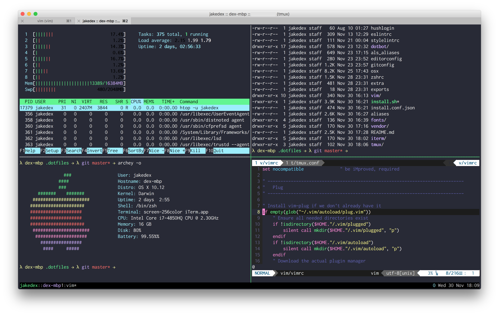

# Dotfiles
My primary configuration files for Arch linux/macOS. These have been tested with both of the aforementioned OSs and a few miscellaneous linux boxes.

### Features
* [Vim configuration/plugins](https://github.com/jakedex/dotfiles/blob/master/vim/vimrc)
* [Tmux configuration](https://github.com/jakedex/dotfiles/blob/master/tmux/tmux.conf)
* [Powerline fonts](https://github.com/powerline/fonts)
* [Dracula color scheme](https://draculatheme.com/) (iTerm + vim)
* zsh [(oh-my-zsh)](https://github.com/robbyrussell/oh-my-zsh)
* [Default Homebrew formulae](https://github.com/jakedex/dotfiles/blob/master/install.sh#L76)



## Installation
Thanks to [dotbot](https://github.com/anishathalye/dotbot), installing my dotfiles is relatively easy.

__Warning__: If you want to give these dotfiles a try, you should first fork this repository, review the code, and remove things you don’t want or need. Don’t blindly use my settings unless you know what that entails.

You can clone the repository wherever you want (I keep mine in `~/.dotfiles`). The [install.sh](https://github.com/jakedex/dotfiles/blob/master/install.sh) script will perform the following actions:

* Run [dotbot](https://github.com/anishathalye/dotbot) to install the symlinks in your home folder
* Run [vim-plug](https://github.com/junegunn/vim-plug)'s `:PlugInstall` and `:PlugClean` to install/clean Vim plugins listed in [.vimrc](https://github.com/jakedex/dotfiles/blob/master/vim/vimrc)
* Install [powerline fonts](https://github.com/powerline/fonts)
* Install [oh-my-zsh](https://github.com/robbyrussell/oh-my-zsh)
* Install [Homebrew](http://brew.sh/) (if it isn't already installed) and install my [brew formulae](https://github.com/jakedex/dotfiles/blob/master/install.sh#L76)

To install, simply copy and paste the following into your command prompt:
```
git clone --recursive https://github.com/jakedex/dotfiles.git ~/.dotfiles && . ~/.dotfiles/install.sh
```
(Notice the recursive flag - you'll need it to initialize and download the git submodules in this repository)

### Sensible macOS Defaults
When setting up a new mac, the `.osx` script will set some sensible OS X defaults. These are my handpicked preferences from [Mathias Bynens' .osx script](https://github.com/mathiasbynens/dotfiles/blob/master/.osx).
The script also installs all of my default applications with [Homebrew Cask](http://caskroom.io/).

## Configuration
The configuration for dotbot is in `install.conf.yaml`. See [dotbot's documentation](https://github.com/anishathalye/dotbot#configuration) for more details on how to link files/directories and run shell commands during the configuration process.

## Inspiration
* [Mathias Bynens'](https://mathiasbynens.be/) ever popular [dotfiles repository and .osx script](https://github.com/mathiasbynens/dotfiles)
* [Ben Altman's](http://benalman.com/) [dotfiles repository](https://github.com/cowboy/dotfiles)
* [Anish Athalye's](http://www.anishathalye.com/) wonderful [dotbot](https://github.com/anishathalye/dotbot) and [dotfiles guide](http://www.anishathalye.com/2014/08/03/managing-your-dotfiles/)

## License
Copyright (c) 2016 Jacob Dexheimer. Released under the MIT License. See [LICENSE.md](https://github.com/jakedex/dotfiles/blob/master/LICENSE) for details.
